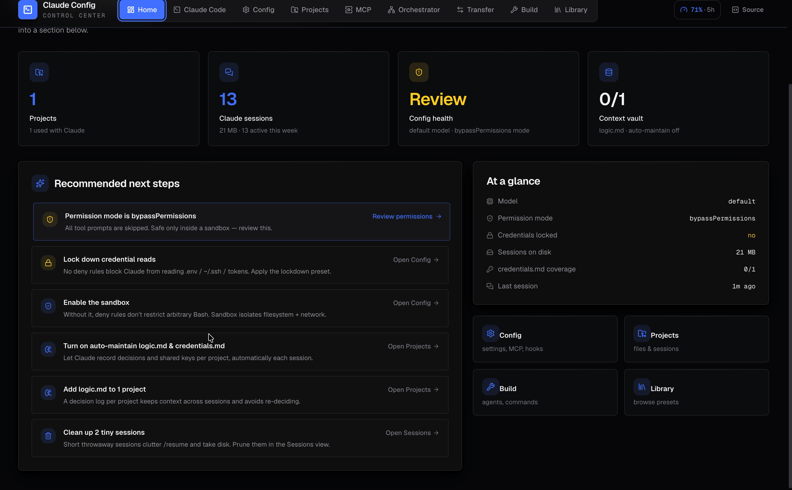
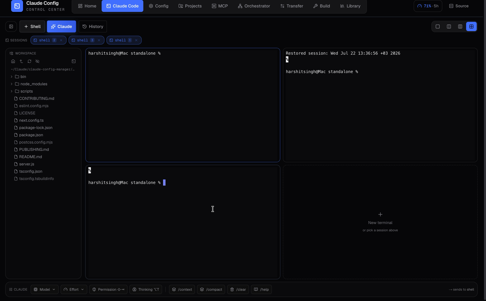
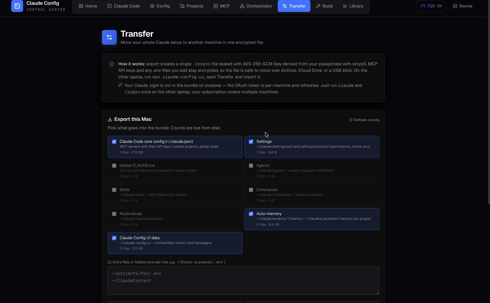

# Claude Config Manager

[](https://www.npmjs.com/package/claude-config-ui)
[](https://github.com/HarshitSingh-PM/claude-config-manager/releases/latest)
[](LICENSE)
[](#requirements)

### The mission control for Claude Code.

Run a **terminal grid of live Claude agents**, edit **every config file** from one place, watch your **usage limits** tick down, move your whole setup between machines **encrypted** — all in one fast, local, open-source desktop app. Nothing leaves your machine.

<p align="center">
  <a href="https://github.com/HarshitSingh-PM/claude-config-manager/releases/latest"></a>
  &nbsp;
  <a href="https://github.com/HarshitSingh-PM/claude-config-manager/releases/latest"></a>
  &nbsp;
  <a href="https://github.com/HarshitSingh-PM/claude-config-manager/releases/latest"></a>
</p>

<p align="center">
  <em>or, in any terminal:</em>&nbsp;&nbsp;<code>npx claude-config-ui</code>
</p>

<p align="center">
  <a href="docs/media/demo.mp4"></a>
  <br>
  <strong><a href="docs/media/demo.mp4">▶ Watch the 40-second tour</a></strong>
</p>

> Files saved by this tool land in Claude Code's standard locations — Claude Code picks them up automatically on the next session start. **No daemons, no symlinks, no special integration step.**

---

## ⌘ The Claude Code workspace

The headline feature: a **full terminal environment for Claude Code, inside the app.** Stop juggling terminal tabs — run your agents in a grid and watch them all at once.

<p align="center">
  
</p>

- **Real terminals, embedded** — spin up as many shells (or one-click **Claude** sessions that launch the `claude` CLI) as you want. Actual PTYs, full color, resize, scrollback.
- **Split 1 / 2 / 3 / 4 ways** — a layout switcher tiles panes so you can run four agents side-by-side and multitask like a cockpit.
- **A file tree that follows your work** — a Nimbalyst-style workspace tree on the left. Click a pane (or `cd` into a project) and the tree **jumps to that folder automatically** so its files are right there. "Open terminal here" on any folder.
- **A control bar for Claude** — a bottom strip that drives the focused session the way you would: pick the **model** and **effort**, cycle **permission mode** (⇧⇥), toggle **extended thinking** (⌥T), and fire `/context`, `/compact`, `/clear`, `/help` — no typing.
- **Drag & drop files** → their absolute paths paste straight into the focused terminal (a dropped folder also becomes the workspace root).
- **Transcripts that survive restarts** — every session is saved to disk. A **History** browser lets you re-open any past session's transcript (colors preserved) or reopen its folder in a fresh terminal. Quit the app mid-run? Your record is still there.
- **A built-in file viewer** — click any file in the tree to open it inline:
  - **Markdown** — rendered preview ⇄ editor, save with ⌘S
  - **HTML** — live sandboxed preview ⇄ source
  - **PDF** — native viewer
  - **Images & code** — inline

---

## 📊 Live usage meter

A gauge next to the header shows exactly how much you have left — pulled from Claude's own local usage cache, so it matches the app precisely:

- **5-hour window**, **weekly**, and **per-model weekly** (Fable 5 / Opus) remaining
- Live **"resets in…" countdowns** for each
- Color-coded: comfortable → low → critical

No more guessing when you'll hit a limit mid-flow.

---

## Everything else it does

|  | |
| --- | --- |
| ⚙️ **Config, all of it** | Edit `settings.json`, `CLAUDE.md`, `.mcp.json`, subagents, slash commands, output styles, keybindings — across all four scopes, every field with a tooltip that says *what* it does and *why* it matters. |
| 🔑 **Credentials once** | Set GitHub / AWS / Vercel / Stripe / 28+ services one time at user scope; they're available to every project. Masked inputs, deep links to each token page. |
| 🧭 **Agent Orchestrator** | A live board to launch one agent or a whole team, watch the tool/sub-agent tree render in real time, and resume any run. Discovers agents already running on your machine. |
| 📦 **Encrypted Transfer** | Pack your entire Claude world into one AES-256-GCM `.ccsync` file and restore it on another laptop with a per-file preview. |
| 🗂️ **Projects & sessions** | A bird's-eye view of every project that uses Claude, plus a per-project decision log (`logic.md`) and key tracker (`credentials.md`). |
| 🏠 **Home dashboard** | Opens on a control center: KPI tiles + **Recommended next steps** derived from your actual setup (lock down credentials, enable the sandbox, review a risky `bypassPermissions` default…). |

---

## Install

### Mac app

Download from the [latest release](https://github.com/HarshitSingh-PM/claude-config-manager/releases/latest):

- **`Claude Config-X.Y.Z-arm64.dmg`** — Apple Silicon (M1 / M2 / M3 / M4, 2020+)
- **`Claude Config-X.Y.Z-x64.dmg`** — Intel Macs (2019 and earlier)

Open the `.dmg`, drag **Claude Config** to **Applications**, launch from Spotlight or Launchpad.

> **First launch (one time):** the app is signed ad-hoc but not notarized (no paid Apple Developer certificate), so macOS Gatekeeper blocks it once. **Right-click the app → Open**, then **Open** in the dialog. Or clear the quarantine flag:
>
> ```bash
> xattr -dr com.apple.quarantine "/Applications/Claude Config.app"
> ```
>
> The **"app is damaged"** seal bug from builds ≤ v0.9.0 is fixed in current releases.

### Windows app

Download `Claude-Config-X.Y.Z-x64-setup.exe` from the [latest release](https://github.com/HarshitSingh-PM/claude-config-manager/releases/latest), run the installer, launch **Claude Config** from the Start menu.

> **First launch (one time):** Windows SmartScreen blocks the unsigned installer. Click **More info** → **Run anyway**. Standard for indie/OSS apps without a code-signing cert.

### Command-line (any OS)

```bash
npx claude-config-ui
```

The launcher picks a free port, opens your browser, and detects your OS-correct paths automatically. `Ctrl+C` to stop.

> The embedded-terminal, drag-and-drop, and macOS onboarding features are richest in the **desktop app** (they need OS access the browser sandbox doesn't allow). Everything else runs identically over `npx`.

---

## Why it exists

Claude Code reads config from 30+ possible files across user, project, project-local, and enterprise scopes. Most people learn the system by trial-and-error or by copy-pasting community gists. This turns that into a guided, visual workflow — and then goes further, giving you a place to actually *run and watch* your agents.

- **Auto-detected paths** — `~/.claude/` on macOS/Linux, `%APPDATA%\Claude\` on Windows, project paths from your repo, enterprise paths from `/Library/Application Support/ClaudeCode/` or `/etc/claude-code/`.
- **Community presets** baked in — Karpathy's 4-rules CLAUDE.md, HumanLayer's skeleton, Trail of Bits credential lockdown, popular hook recipes — one click.
- **Auto-backup** — every save writes a `*.bak-<timestamp>`. Nothing is lost.
- **Path sandbox** — the API refuses to read or write anything outside your home directory, cwd, or known Claude Code enterprise dirs.

---

## The four scopes

Mirrors how Claude Code actually resolves config:

| Tab | What | Path |
| --- | --- | --- |
| **Global Claude** | Your personal user-level config (all projects) | `~/.claude/` |
| **Global Project** | Team-shared project config (committed to git) | `<project>/.claude/` + `CLAUDE.md` + `.mcp.json` |
| **Local Claude** | Personal overrides for one project (gitignored) | `<project>/.claude/settings.local.json` + `CLAUDE.local.md` |
| **Project Local (Enterprise)** | Organization policy deployed by IT (highest precedence) | `/Library/Application Support/ClaudeCode/` · `C:\Program Files\ClaudeCode\` · `/etc/claude-code/` |

Precedence (later wins): user → project shared → project local → enterprise.

### What it edits

- **`settings.json`** — model, permissions (allow/deny/ask), hooks, status line, env, sandbox, telemetry, output style, theme.
- **Credentials** *(Global Claude only)* — AWS, GCP, Azure, Cloudflare, Fly, Vercel, Netlify, GitHub, GitLab, Postgres, Supabase, Neon, MongoDB, Redis, Slack, Linear, Notion, OpenAI, Anthropic, Stripe, Sentry, Datadog and more — masked inputs, eye-toggles, deep links, written into the `env` block of `~/.claude/settings.json`.
- **`CLAUDE.md`** / **`CLAUDE.local.md`** — markdown editor with line/char counts, 12 section templates, and four full-doc presets (Karpathy, HumanLayer, Trail of Bits, Minimal).
- **`.mcp.json`** · **`keybindings.json`** · **`agents/`** · **`commands/`** · **`output-styles/`** · **`managed-settings.json`** — all guided, all templated.

---

## Agent Orchestrator

A live, visual team board for running Claude agents. Launch one on a task, or launch several at once — each runs concurrently as its own card.

- **See what's already running** — discovers `claude` sessions you didn't launch here (other terminals/windows) and shows each one's activity, model, project, and a `claude --resume` command.
- **Launch agents or a whole team** — pick the general agent or any subagent definition; choose model, permission mode, working dir, turn cap. Run a **team** template (Build squad / Ship crew / Research pod / Bug hunt) **orchestrated** (a lead delegates) or **parallel**.
- **Campaigns** — multi-week work with a self-updating plan that survives restarts; hit **Run next session** to pick up exactly where it left off.
- **Watch the hierarchy** — every tool call, skill, MCP call, and spawned sub-agent renders as a color-coded tree as it happens. Live cost, tokens, turns per card; a global skill-activity feed.
- **Measurement** — aggregate finished runs: success rate, cost, tokens, breakdowns by agent and model.

Under the hood it spawns headless `claude -p … --output-format stream-json` and parses the event stream — no extra dependencies, using your already-authenticated `claude` CLI.

---

## MCP servers

A dedicated **MCP** tab across all three scopes. **See** every server with its transport/auth/`alwaysLoad` state, **enable/disable** to save context (reversibly stashed, with a backup), **add/edit/remove** with guided fields, and **resolve issues** with per-server diagnostics that give the exact copy-paste fix (`/mcp`, `claude mcp get`, `reset-project-choices`). Secrets masked.

---

## Transfer — move your setup to another machine

Pack your whole Claude world into one encrypted `.ccsync` file and restore it elsewhere.

<p align="center">
  
</p>

- **What goes in** — live-counted categories: `~/.claude.json` (MCP servers + API keys), settings, global `CLAUDE.md`, agents, skills, commands, keybindings, per-project auto-memory, and the app's own data. Add extra files/folders — `.env` files ride along.
- **Real encryption** — sealed with AES-256-GCM, key derived from your passphrase with scrypt. Safe over AirDrop, iCloud Drive, or a USB stick.
- **Safe restore** — a per-file preview (new / changed / identical); anything you overwrite is backed up first. Restores refuse paths outside your home directory.
- **Login stays out on purpose** — the OAuth token is per-machine; run `claude` + `/login` once on the new laptop.

---

## Projects, sessions & memory

A bird's-eye view of every project that uses Claude — discovered by scanning your code roots and decoding the working directories of recent Claude Code sessions. Edit each project's local files inline (`CLAUDE.md`, `.claude/settings.json`, `.mcp.json`, …).

- **Claude sessions** — the same list `/resume` shows, with first prompt, last-worked time, message count, size, and detected project. Sort, **rename**, **reassign**, or **delete** throwaway sessions to reclaim disk.
- **`logic.md`** — a per-project decision log in a central context vault, so rationale isn't re-litigated across sessions. Toggle **Auto-maintain** to have Claude read + append it every session.
- **`credentials.md`** — a local-only, masked inventory of the keys each project uses, so you know what exists and when to rotate.

---

## Design

A redesigned, high-contrast **mechanical** interface: a monochrome canvas with a disciplined **primary-color** accent system — **blue** for interactive/active, **red** for live/destructive, **yellow** for warnings — over a precise engineering-grid backdrop. Animated view transitions, count-up metrics, and skeleton loaders throughout, all honoring `prefers-reduced-motion`. A motivational line greets you on open, and a first-run macOS gate walks you through the folder permissions Claude needs to create projects.

---

## Requirements

- Node.js 20.9 or newer
- macOS, Windows, or Linux

## Alternative install paths

**From source:**

```bash
git clone https://github.com/HarshitSingh-PM/claude-config-manager.git
cd claude-config-manager
npm install
npm run dev        # → http://localhost:3000
```

**Global install:**

```bash
npm install -g claude-config-ui
claude-config-ui   # or: ccm
```

> The npm package is `claude-config-ui` (the bare name was taken); the GitHub repo keeps `claude-config-manager`.

## Configuration

Everything is auto-detected. The only thing you set is the **project directory** for project-scoped tabs (defaults to where you launched). No `.env`, no config file.

- `PORT` — override the default `3737`.
- `CCM_NO_OPEN=1` — don't auto-open the browser.

## Safety

- Every write makes a timestamped `.bak-*` first (autosave takes one per file per session).
- The file API refuses paths outside `~`, `cwd`, and known enterprise dirs; the same sandbox applies to the terminal file tree and viewer.
- Terminal transcripts are stored locally under `~/.claude-config-ui/terminals/` (most-recent 100 retained).
- Credentials are written to the `env` block of `~/.claude/settings.json` — **plain text on disk**. Fine for personal API keys; for high-blast-radius secrets use Claude Code's `apiKeyHelper` instead.

## Stack

- Next.js 16 (App Router, Turbopack, React 19.2) — standalone server output for `npx`
- TypeScript strict · Tailwind CSS 4 · Framer Motion · Radix UI · Lucide
- `node-pty` + `@xterm/xterm` for the embedded terminals (N-API prebuilds — no native rebuild)
- Electron for the desktop `.dmg` / `.exe` distribution (the npm package is pure Node)

## Building desktop apps yourself

```bash
npm install
npm run dmg          # macOS arm64 .dmg → dist-electron/
npm run exe          # Windows x64 NSIS .exe → dist-electron/
```

> Cross-compiling to Windows from Apple Silicon needs Rosetta (`sudo softwareupdate --install-rosetta --agree-to-license`). Builds are unsigned by default — set `mac.identity` / `win.certificateFile` in `package.json#build` to sign for distribution.

## Contributing

See [CONTRIBUTING.md](./CONTRIBUTING.md). Easy wins: add a service to the Credentials catalog, a `CLAUDE.md` section template, or a subagent / slash-command template (`src/lib/presets/`).

## License

MIT. See [LICENSE](./LICENSE).

## Acknowledgements

Schema and presets drawn from the official Claude Code docs, [awesome-claude-code](https://github.com/hesreallyhim/awesome-claude-code), [trailofbits/claude-code-config](https://github.com/trailofbits/claude-code-config), [awesome-claude-code-subagents](https://github.com/VoltAgent/awesome-claude-code-subagents), [wshobson/commands](https://github.com/wshobson/commands), HumanLayer's "Writing a good CLAUDE.md", Karpathy's CLAUDE.md gist, and [claude-code-hooks-mastery](https://github.com/disler/claude-code-hooks-mastery). Terminal file-tree UX inspired by Nimbalyst.
